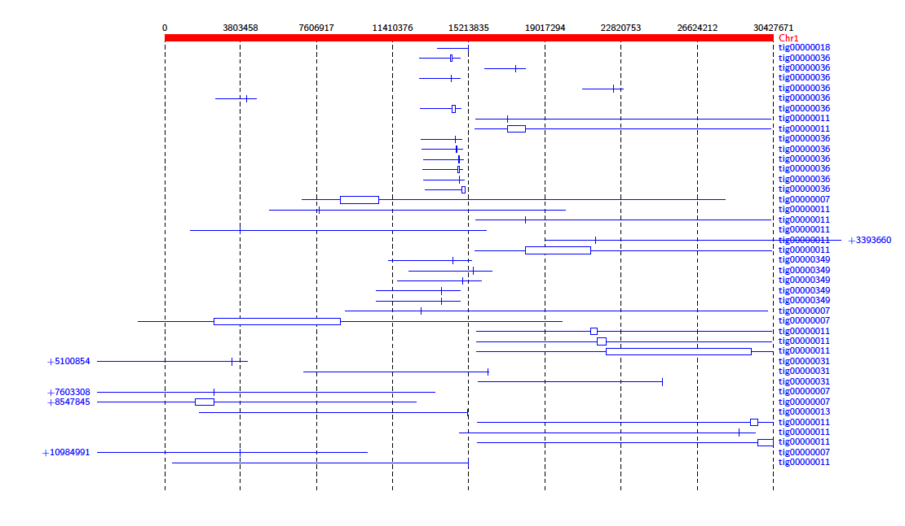
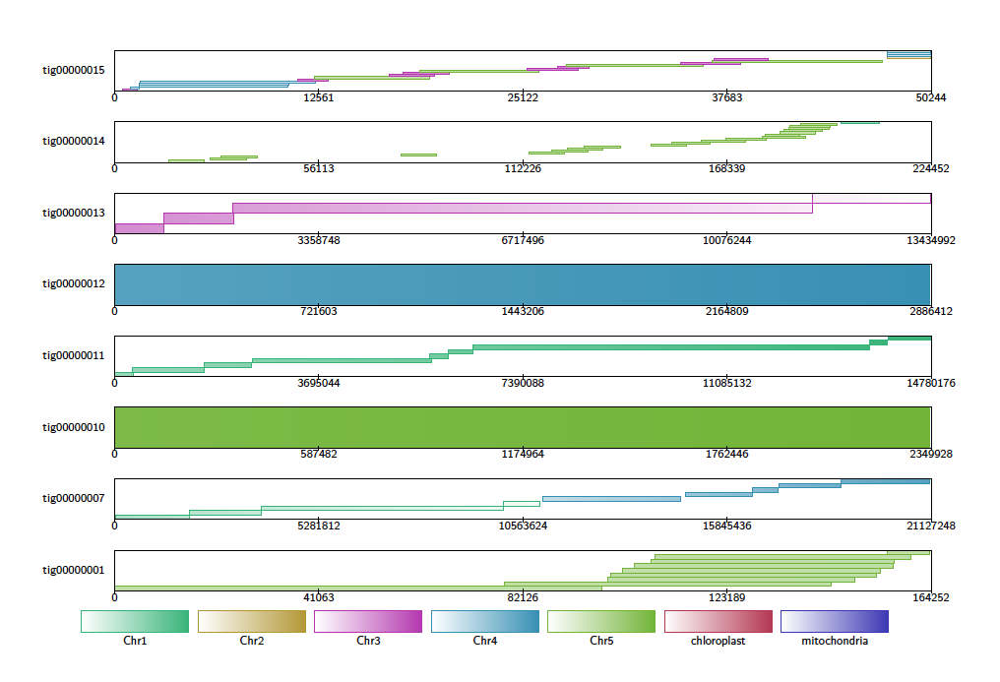
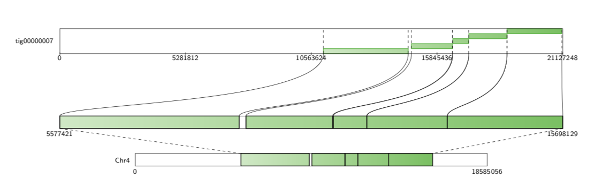
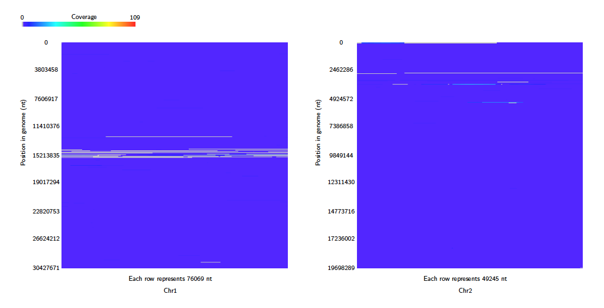
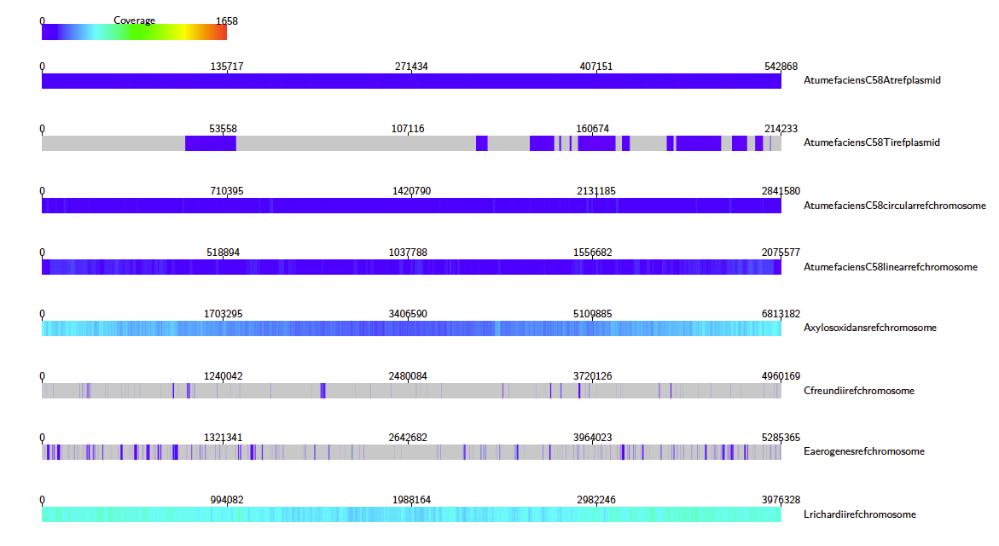
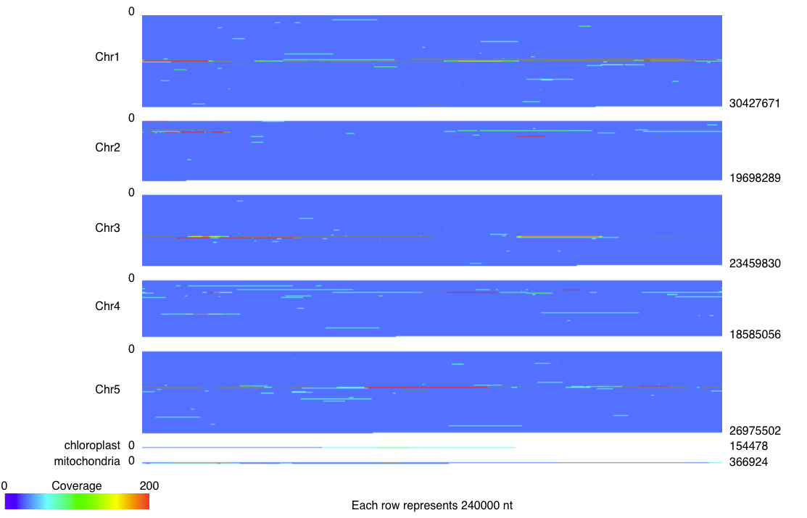

Diagrams
=================

Alignment Diagram
-----------------

The Alignment Diagram draws alignments between a target (or reference) sequence (drawn in red), and query sequences. Each query sequence is represented by a line underneath the target sequence, with the alignment drawn as a box aligned to the target sequence.

This diagram type accepts the following input formats

- paf
- psl
- coords
- tiling
- blast

and outputs the following formats

- tex
- svg.

Contig Alignment Diagram
------------------------

For each query contig, the Contig Alignment Diagram draws a rectangle representing the query, containing the most prominent alignments to the reference contigs. These alignments are colour coded by target contig, and shaded to give an indication of the position in the target, and the orientation of the alignment. If the ``-filter`` option is not used, only the longest 20 alignments are drawn for each query contig.

This diagram type accepts the following input formats

- paf
- psl
- coords
- tiling
- blast

and outputs the following formats

- tex
- svg.

If in addition, the user specifies a query contig and a reference contig, a detailed diagram containing only these alignments is produced.

Coverage Map Diagram
--------------------

Alignments are binned based on their position in the target contigs, and counted to calculate the coverage of each bin. By default, the bin size is 30 bp, but this can be set using the ``-binsize`` option. To avoid counting the same query region multiple times, alignments with overalpping query coordinates are filtered by choosing the longest alignment. For each target contig a heatmap image is produced in which each pixel represents the coverage of a bin. These are arranged in a tex or svg file. Note that each heatmap image is a fixed size, so the pixel scale is adjusted to fit. By default, square images are produced where the rows are read top to bottom, from left to right, as below.

If the ``coverageType`` option is set to ``long``, then the heatmap consists of one row for each target, read left to right.

This diagram type accepts the following input formats

- paf
- psl
- coords
- tiling
- blast
- sam

and outputs the following formats

- tex
- svg.

Genome Coverage Diagram
-----------------------

As in the Coverage Map diagram, alignments are binned based on their position in the target contigs. By default, the bin size is 30 bp, but this can be set using the ``-binsize`` option. One heatmap is produced showing the coverage over all the target contigs. Unlike the Coverage Map Diagram, the scale for the heatmaps remains the same across all the target contigs.

This diagram type accepts the following input formats

- paf
- psl
- coords
- tiling
- blast
- sam

and outputs the following formats

- svg.

