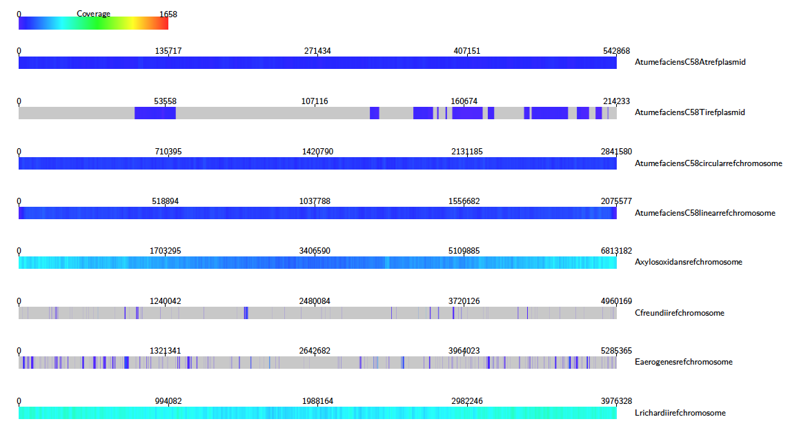
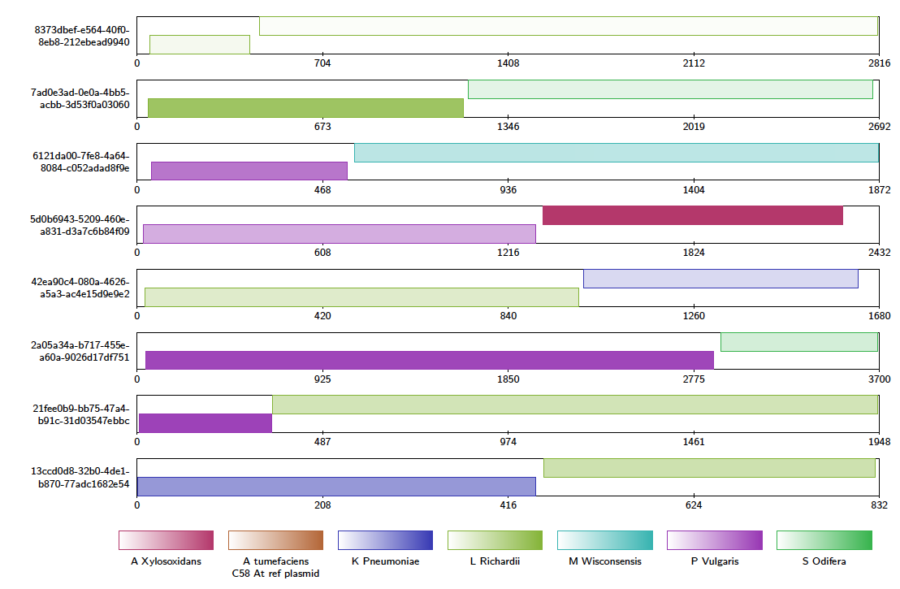

Example
=================

This section takes the user through the basic functionality using example data that can be found in the github repository. First, download the repository and extract the files from ``.../Alvis/tutorial_data/tutorial_data.tar`` as follows::

	mkdir /Users/.../Alvis_example
	tar -C  /Users/.../Alvis_example -xvf /path/to/Alvis/tutorial_data/tutorial_data.tar

The Alvis_example directory now contains a directory containing three text files in the PAF format produced with minimap2:

- alignments.paf: a file of alignments between the reads of a nanopore sequencing run and a set of bacterial reference genomes.
- alignments_sample.paf: a small sample of alignments from alignments.paf.
- assembly_mapping.paf: contains alignments between an assembly of Klebsiella Pneumoniae and a reference genome.

First, we will create coverage maps to show which species were present in the sample, and their relative abundances.  From the terminal, navigate to the ``Alvis_example/tutorial_data`` directory created in the previous step, and type::

	mkdir output
	Java -jar /path/to/Alvis/dist/Alvis.jar -inputfmt paf -outputfmt tex -type coverageMap -coverageType long -in alignments.paf -outdir output/ -out example

Once this has executed, the output directory, ``/Users/…/Alvis_example/output/`` will contain a file called ``example_coverageMap.tex``. This may be compiled with your favourite tex compiler to create a PDF of the coverage map diagrams, e.g.::

	cd output/
	pdflatex example_coverageMap.tex
	cd ..

We can see clearly that e.g. A. Xylosoxidans and L. Richardii are relatively abundant in the sample, whereas C. Freundii appears to not be present at all.

To create an SVG file of this diagram instead, type::

	Java -jar /path/to/Alvis/dist/Alvis.jar -inputfmt paf -outputfmt svg -type coverageMap -coverageType long -in alignments.paf -outdir output/ -out example

The SVG files created in the ``output`` directory can be viewed immediately with an internet browser. 

Now we will look for chimeric reads from a subsample of the alignments, using Alvis' chimera filtering option. In the terminal, type::

	Java -jar /path/to/Alvis/dist/Alvis.jar -inputfmt paf -outputfmt tex -type contigAlignment -chimeras -in alignments_sample.paf  -outdir output/ -out example

A file called “example_contigAlignment.tex” is created in the output directory. This file contains a contig alignment diagram for each query that Alvis thinks could be a chimera. After compiling the TEX file as before, the user may inspect the alignments for each of these reads. Note that these alignments could also have been caused by similarity in the reference sequences.

The data package also contains a PAF file of alignments between an assembly of all the reads that mapped to K. Pneumoniae, and a reference genome. We will investigate the makeup of the assembly contigs. In the terminal, type::

	Java -jar /path/to/Alvis/dist/Alvis.jar -inputfmt paf -outputfmt tex -type alignment -filter -in assembly_mapping.paf  -outdir output/ -out example

As before, compile the TEX file produced to obtain a pdf.

.. image:: images/alignment_tutorial.png

This diagram shows us that almost all of the reference genome is covered by tig00000001. However, most of these alignments are transpositions.

