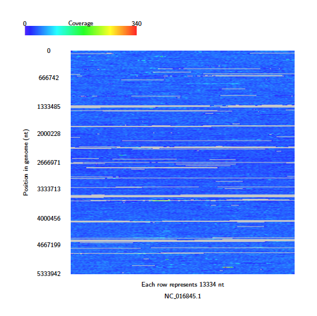
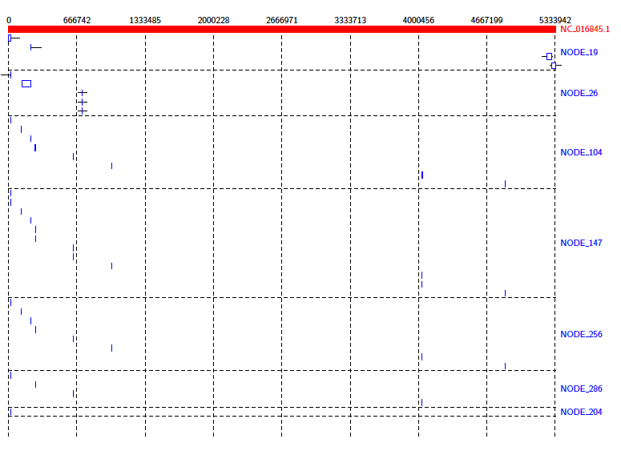

Examples
=================

Nanopore Example
-----------------

This section takes the user through the basic functionality using example data that can be found in the github repository. First, download the repository and extract the files from ``.../Alvis/tutorial_data/tutorial_data.tar`` as follows::

	mkdir /Users/.../Alvis_example
	tar -C  /Users/.../Alvis_example -xvf /path/to/Alvis/tutorial_data/tutorial_data.tar

The Alvis_example directory now contains a directory containing three text files in the PAF format produced with minimap2:

- alignments.paf: a file of alignments between the reads of a nanopore sequencing run and a set of bacterial reference genomes.
- alignments_sample.paf: a small sample of alignments from alignments.paf.
- assembly_mapping.paf: contains alignments between an assembly of Klebsiella Pneumoniae and a reference genome.

First, we will create coverage maps to show which species were present in the sample, and their relative abundances.  From the terminal, navigate to the ``Alvis_example/tutorial_data`` directory created in the previous step, and type::

	mkdir output
	Java -jar /path/to/Alvis/dist/Alvis.jar -inputfmt paf -outputfmt tex -type coverageMap -coverageType long -in alignments.paf -outdir output/ -out example

Once this has executed, the output directory, ``/Users/…/Alvis_example/output/`` will contain a file called ``example_coverageMap.tex``. This may be compiled with your favourite tex compiler to create a PDF of the coverage map diagrams, e.g.::

	cd output/
	pdflatex example_coverageMap.tex
	cd ..

.. image:: images/coverage_map_tutorial.png

We can see clearly that e.g. A. Xylosoxidans and L. Richardii are relatively abundant in the sample, whereas C. Freundii appears to not be present at all.

To create an SVG file of this diagram instead, type::

	Java -jar /path/to/Alvis/dist/Alvis.jar -inputfmt paf -outputfmt svg -type coverageMap -coverageType long -in alignments.paf -outdir output/ -out example

The SVG files created in the ``output`` directory can be viewed immediately with an internet browser. 

Now we will look for chimeric reads from a subsample of the alignments, using Alvis' chimera filtering option. In the terminal, type::

	Java -jar /path/to/Alvis/dist/Alvis.jar -inputfmt paf -outputfmt tex -type contigAlignment -chimeras -in alignments_sample.paf  -outdir output/ -out example

A file called “example_contigAlignment.tex” is created in the output directory. This file contains a contig alignment diagram for each query that Alvis thinks could be a chimera. After compiling the TEX file as before, the user may inspect the alignments for each of these reads. Note that these alignments could also have been caused by similarity in the reference sequences.

.. image:: images/chimeras_tutorial.png

You may also look for chimeric reads from the whole read set by using the above command and replacing the ``-in`` file with ``alignments.paf``. This will produce a large tex file, which when compiled contains a contig alignment diagram for every chimeric read, and is 4,381 pages long. This is far too large to be inspected manually, so instead Alvis can write a plain text file for computer parsing, describing each chimera, using the following command::

	Java -jar /path/to/Alvis/dist/Alvis.jar -inputfmt paf -outputfmt tex -type contigAlignment -chimeras -printChimeras -in alignments.paf  -outdir output/ -out example

The file ``chimeras.txt`` (see :ref:`filtering`) can then be found in the output directory.

The data package also contains a PAF file of alignments between an assembly of all the reads that mapped to K. Pneumoniae, and a reference genome. We will investigate the makeup of the assembly contigs. In the terminal, type::

	Java -jar /path/to/Alvis/dist/Alvis.jar -inputfmt paf -outputfmt tex -type alignment -filter -in assembly_mapping.paf  -outdir output/ -out example

As before, compile the TEX file produced to obtain a pdf.

.. image:: images/alignment_tutorial.png

This diagram shows us that almost all of the reference genome is covered by tig00000001. However, most of these alignments are transpositions.

Short Reads Example
---------------------

Alvis can also be used with short reads! In this section we give a tutorial on using Alvis to help analyse short read data. First, download the Klebsiella pneumoniae reads from run ERR2099161 found `here <https://www.ebi.ac.uk/ena/browser/view/PRJEB22207>`_, and the strain HS11286 reference fasta (NCBI Reference Sequence: NC_016845.1) found `here <https://www.ncbi.nlm.nih.gov/nuccore/NC_016845>`_ to your working directory. We would like to know how well these reads cover the reference genome. Use your favourite read aligner to align the reads to the reference in SAM format e.g. ::

    bowtie2-build klebsiella_pneumoniae.fasta klebsiella_pneumoniae
	bowtie2 -x klebsiella_pneumoniae -1 ERR2099161_1.fastq -2 ERR2099161_2.fastq -S read_alignments.sam

Next use Alvis to build a coverage map diagram ::

	Java -jar /path/to/Alvis/dist/Alvis.jar -inputfmt sam -outputfmt tex -type coveragemap -in read_alignments.sam -outdir alvis_coveragemap/ -out kleb_reads

The coverage map shows that read coverage is quite low, with some large sections of the genome not covered at all. 

Next, perform an assembly of these reads using your favourite short read assembler, e.g. ::

	spades.py -1 ERR2099161_1.fastq -2 ERR2099161_2.fastq -o assembly

From the coverage of the reads, we don't expect this assembly to be that great. Use the tool dnadiff (from `MUMmer <http://mummer.sourceforge.net/>`_) to obtain a report and alignments on the assembly against the reference. ::

    dnadiff klebsiella_pneumoniae.fasta assembly/contigs.fasta

This produces a delta file (`out.delta`) from which Alvis can create a diagram. First we need to get it into a format that Alvis understands. ::

	show-coords -B out.delta > out.coords

Then we can create an alignment diagram. ::

    Java -jar /path/to/Alvis/dist/Alvis.jar -inputfmt coords -outputfmt tex -type alignment -in out.coords -outdir alvis_assembly/ -out kleb_assembly

From the diagram we can see that the reference genome is covered sporadically across many contigs, most of which have very small alignments to different sections of the genome.

We can get a better idea of the contigs that are making a significant contribution by using the ``-filter`` option. Run the above command again, this time with the ``-filter`` option. (Note: this will overwrite the previous diagram.) ::

    Java -jar /path/to/Alvis/dist/Alvis.jar -inputfmt coords -outputfmt tex -type alignment -in out.coords -outdir alvis_assembly/ -out kleb_assembly -filter

This gives us a better idea of how the assembly covers the reference.

.. image:: images/short_read_assembly_filter.png
