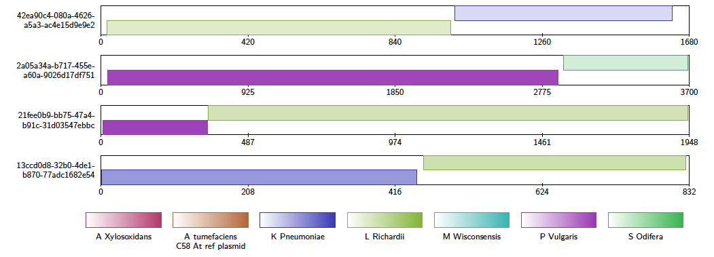

Usage
==========

alvis is run from the command line etc.

Here are the options

Input Formats
-------------

alvis accepts a variety of alignment formats. These are specified by the option ``-inputfmt <format>``, where ``<format>`` is one of the following:

- ``paf``
- ``psl``
- ``blast``
- ``coords``
- ``tiling``
- ``sam``
- ``pileup``

A coords file can be created from a mummer .delta file using the ``show-coords`` command. For this file to work with alvis, the ``-B`` option must be specified (see `here <http://mummer.sourceforge.net/manual/#coords/>`_ for more details).

Similarly, a tiling file can be created from a mummer .delta file using the ``show-tiling`` command. In this case, the ``-a`` option must be specified (see `here <http://mummer.sourceforge.net/manual/#tiling/>`_ for more details).

If blast is given as the format, the input file must have been created by blast using the tabular option, i.e. with "-outfmt 6" specified. Furthermore, the following fields must be present in some order:

- ``qseqid``
- ``sseqid``
- ``qstart``
- ``qend``
- ``sstart``
- ``send``

The parameter passed to blast after the ``-outfmt`` option must also be given to alvis after the -blastfmt option (e.g. ``-blastfmt '6 qseqid sseqid qstart qend sstart ssend'``).

Diagrams
---------

The type of diagram is specified with the ``-type <diagram>`` option etc. The currently available diagrams are:

- ``alignment``
- ``contigAlignment``
- ``coveragemap``
- ``genomecoverage``
- ``pileup``

Detailed information for each diagram can be found in the :doc:`diagrams` section.

Output Formats
--------------

alvis can currently output most diagrams in two formats: SVG and laTeX. These are specified by the ``-outputfmt <format>`` option, where ``<format>`` is one of ``tex`` and ``svg``. Note that if ``tex`` is specified, the user must compile the .tex file that is created to obtain a pdf. Currently the diagrams are drawn with the tikz library, so the user must have this installed.

The following table shows the accepted input and output formats for each diagram.

+---------------------------+----------------------------------------------------+-------------------+
|                           |                      Input Formats                 |  Output Formats   |
|                           +-------+--------+--------+-----+--------+-----+-----+---------+---------+
|                           | blast | coords | tiling | paf | pileup | psl | sam |   svg   |   tex   |
+===========================+=======+========+========+=====+========+=====+=====+=========+=========+
| Alignment Diagram         |   ✓   |   ✓    |   ✓    |  ✓  |        |  ✓  |     |    ✓    |    ✓    |
+---------------------------+-------+--------+--------+-----+--------+-----+-----+---------+---------+
| Contig Alignment Diagram  |   ✓   |   ✓    |   ✓    |  ✓  |        |  ✓  |     |    ✓    |    ✓    |
+---------------------------+-------+--------+--------+-----+--------+-----+-----+---------+---------+
| Coverage Map Diagram      |   ✓   |   ✓    |   ✓    |  ✓  |        |  ✓  |  ✓  |    ✓    |    ✓    |
+---------------------------+-------+--------+--------+-----+--------+-----+-----+---------+---------+
| Genome Coverage Diagram   |   ✓   |   ✓    |   ✓    |  ✓  |        |  ✓  |  ✓  |    ✓    |         |
+---------------------------+-------+--------+--------+-----+--------+-----+-----+---------+---------+
| Pileup Coverage Diagram   |       |        |        |     |    ✓   |     |     |         |    ✓    |
+---------------------------+-------+--------+--------+-----+--------+-----+-----+---------+---------+

Filtering
----------

The user can filter alignments using the ``-filter`` option. This will cause alvis to ignore all alignments with length less than 0.5% of the reference contig size. (Note, this option is currently only used by the alignment diagram.)

When using the ``-chimera`` option, alvis will display only those alignments that it thinks could be a chimera.

